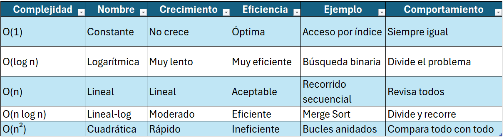
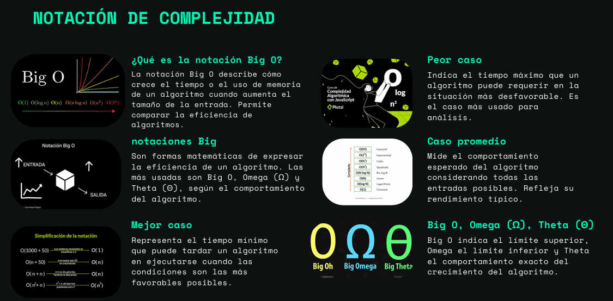
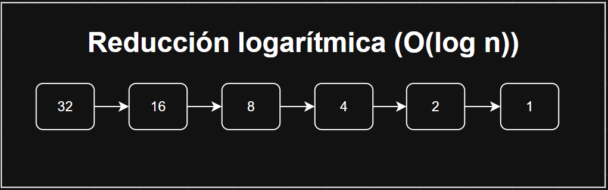

# **Teoria de la complejidad**
---
## **Integrantes**

- Miguel Alexander Maza Sinchi
- Edwin Patricio Pintado Reinoso
- Galo Patricio Prieto Tapia
- Kevin Joel Sacaquirin Morocho
- Anderson Israel Vallejo Loja

---
## **¿Qué es la Teoría de la Complejidad?**

La teoría de la complejidad computacional estudia cómo varían los recursos necesarios (tiempo y memoria) para resolver un problema en función del tamaño de la entrada.

Su objetivo es analizar la eficiencia de los algoritmos y determinar su comportamiento cuando los datos crecen, permitiendo comparar distintas soluciones de manera objetiva.

---
## **Eficiencia de algoritmos**

### Coste temporal

Representa el tiempo de ejecución de un algoritmo según el tamaño de entrada (n).

### Coste espacial

Representa la cantidad de memoria utilizada durante la ejecución.

## **Factores de tiempo de ejecución**

El tiempo de ejecución no depende solo del código, sino de varios factores:

### Factores propios

Dependen del diseño del algoritmo:
-	Número de operaciones 
-	Estructuras de control (bucles, recursión) 
-	Estructuras de datos utilizadas 

### Factores circunstanciales

Son externos al algoritmo:
-	Hardware (CPU, RAM) 
-	Sistema operativo 
-	Lenguaje de programación 
-	Carga del sistema 

### Análisis teórico

Se basa en modelos matemáticos sin ejecutar el programa. Permite estimar el crecimiento del algoritmo.
Permite estimar su comportamiento con notaciones como Big O:
- O(n) → peor caso (límite superior)
- Ω(n) → mejor caso (límite inferior)
- Θ(n) → caso exacto (ajustado)

### Análisis experimental

Se mide el tiempo real ejecutando el algoritmo con distintos tamaños de entrada.
Se prueba con diferentes tamaños de entrada (n = 100, 1000, 10000) para observar su crecimiento.

---
## **Notación Big O**

### ¿Qué es?

La notación Big O describe el crecimiento del tiempo o memoria de un algoritmo en función del tamaño de entrada n, enfocándose en su comportamiento asintótico (cuando n es grande).

### Tipos de análisis (casos)

- Mejor caso (Ω – Omega)
Es el escenario más favorable posible para el algoritmo.
Representa el menor tiempo de ejecución.

- Peor caso (O – Big O)
Es el escenario más desfavorable.
Representa el límite superior del tiempo de ejecución.

- Caso promedio (Θ – Theta)
Representa el comportamiento esperado en condiciones normales.

### Notaciones importantes con ejemplos

### O(1) – Complejidad constante

La complejidad O(1) significa que el tiempo o espacio que utiliza un algoritmo no cambia sin importar el tamaño de la entrada (n).
Esto ocurre cuando el algoritmo ejecuta una cantidad fija de operaciones, sin depender de estructuras repetitivas o datos adicionales.

### O(n) – Complejidad lineal

La complejidad O(n) significa que el tiempo de ejecución crece de forma proporcional al tamaño de la entrada.
Si los datos aumentan, el número de operaciones aumenta en la misma proporción.

### O(n²) – Complejidad cuadrática

La complejidad O(n²) ocurre cuando un algoritmo tiene dos bucles anidados, donde cada uno depende de n.
Esto provoca que el número de operaciones crezca como n × n.

### O(log n) – Complejidad logarítmica

La complejidad O(log n) ocurre cuando el problema se reduce a la mitad en cada paso.
En lugar de revisar todos los elementos, el algoritmo descarta una gran parte del problema en cada iteración.
Es muy eficiente en grandes volúmenes de información.

### O(n log n) – Complejidad logarítmica lineal

La complejidad O(n log n) combina dos comportamientos:
- Un proceso lineal O(n)
- Un proceso logarítmico O(log n)
Esto significa que el algoritmo recorre todos los elementos, pero realiza divisiones o procesos logarítmicos dentro de ese recorrido.

### En resumen:

- O(1) → constante (ideal)
- O(n) → crecimiento proporcional
- O(n²) → ineficiente en grandes volúmenes
- O(log n) → muy eficiente
- O(n log n) → eficiente para grandes datos

---

## Ejemplos

- [Ejemplos de Complejidad](#ejemplos-de-complejidad-en-java)

---

### En conclusión

- La notación Big O es fundamental para diseñar algoritmos escalables y evitar que el rendimiento se degrade al aumentar la cantidad de datos.
- Permite comparar soluciones y elegir la más eficiente antes de implementarla.

## recursos visuales

### Ejemplo de como funciona el programa

### Tabla comparativa entre complejidades

### Imagen extraida de nuestra presentacion

### Imagen representariva de la reduccion logaritmica



---

## Ejemplos de Complejidad en Java

### O(1) – Complejidad constante
**Archivo:** ComplejidadConstante.java
**Definición:** La complejidad O(1) ocurre cuando el algoritmo ejecuta una cantidad fija de operaciones, sin importar el tamaño de la entrada. En este caso, el código solo realiza operaciones simples como suma de variables, por lo que el tiempo de ejecución es constante.
**Relación:** El método realiza operaciones aritméticas fijas sin bucles.
```java
public void ejemplo() {
        System.out.println("Ejemplo O(1)");

        int x = 10;
        int y = 20;
        int suma = x + y;

        System.out.println("Resultado: " + suma);
    }
}
```
### Explicación de la complejidad
- No hay bucles ni estructuras repetitivas
- Solo se ejecutan operaciones fijas
- Por lo tanto, siempre tarda lo mismo sin importar la entrada

---
### O(n) – Complejidad lineal
**Archivo:** ComplejidadLineal.java
**Definición:** La complejidad O(n) se presenta cuando el algoritmo recorre los datos una sola vez mediante un ciclo. En este caso, el número de iteraciones depende directamente del valor de n, por lo que el tiempo de ejecución crece de forma proporcional.
**Relación:** El bucle for ejecuta n iteraciones.
```java
public void ejemplo() {
        System.out.println("Ejemplo O(n)");

        int n = 5;

        for (int i = 0; i < n; i++) {
            System.out.println("Iteración: " + i);
        }
    }
}
```
### Explicación de la complejidad
- Existe un solo bucle que recorre n elementos
- El número de operaciones crece proporcionalmente a n
- Si n aumenta, el tiempo también aumenta en la misma proporción

---
### O(n²) – Complejidad cuadrática
**Archivo:** ComplejidadCuadratica.java
**Definición:** La complejidad O(n²) ocurre cuando el algoritmo utiliza dos ciclos anidados. En este caso, cada elemento es comparado o procesado con todos los demás, lo que genera un crecimiento cuadrático del número de operaciones.
**Relación:** Dos bucles anidados generan n × n operaciones.
```java
public void ejemplo() {
        System.out.println("Ejemplo O(n²)");

        int n = 3;

        for (int i = 0; i < n; i++) {
            for (int j = 0; j < n; j++) {
                System.out.println(i + "," + j);
            }
        }
    }
}
```
### Explicación de la complejidad
- Hay dos bucles anidados dependientes de n
- Cada elemento se combina con todos los demás
- El crecimiento es cuadrático (n × n)

---
### O(log n) – Complejidad logarítmica
**Archivo:** ComplejidadLogaritmica.java
**Definición:** La complejidad O(log n) aparece cuando el problema se reduce a la mitad en cada iteración. En este caso, el algoritmo disminuye progresivamente el valor de n, reduciendo rápidamente la cantidad de operaciones necesarias.
**Relación:** Cada ciclo divide el valor de n entre 2.
```java
public void ejemplo() {
        System.out.println("Ejemplo O(log n)");

        int n = 16;

        while (n > 1) {
            System.out.println(n);
            n = n / 2;
        }
    }
}
```
### Explicación de la complejidad
- En cada iteración el valor se divide entre 2
- El número de pasos necesarios es pequeño incluso si n es grande
- No recorre todos los elementos, solo reduce el problema

---
### O(n log n) – Complejidad logarítmica lineal
**Archivo:** ComplejidadNLogN.java
**Definición:** La complejidad O(n log n) se obtiene cuando se combina un recorrido lineal con un proceso logarítmico. En este caso, el algoritmo recorre todos los elementos y, dentro de cada iteración, realiza una reducción progresiva del problema.
**Relación:** 
- El bucle externo recorre n elementos → O(n)
- El bucle interno reduce el problema a la mitad → O(log n)
```java
public void ejemplo() {

        System.out.println("Ejemplo O(n log n)");

        int n = 5;

        // Parte O(n)
        for (int i = 0; i < n; i++) {

            System.out.println("Elemento " + i);

            // Parte O(log n)
            int temp = n;

            while (temp > 1) {
                System.out.println("  proceso interno: " + temp);
                temp = temp / 2;
            }
        }
    }
}
```
### Explicación de la complejidad
- El bucle externo recorre n elementos (O(n))
- El bucle interno reduce el problema a la mitad (O(log n))
- La combinación de ambos genera O(n log n)
- Es común en algoritmos de ordenamiento eficientes como Merge Sort

---

## Conclusiones

### ¿Qué complejidad es más costosa y por qué?

La complejidad más costosa analizada es O(n²), ya que el uso de bucles anidados provoca que el número de operaciones crezca de forma cuadrática. Esto significa que, al aumentar el tamaño de los datos, el tiempo de ejecución se incrementa rápidamente en comparación con otras complejidades, volviéndola poco eficiente para grandes volúmenes de información.

### ¿Qué aprendieron del análisis?

A partir del análisis realizado, se comprendió que un algoritmo no es eficiente únicamente porque funcione correctamente, sino por la cantidad de recursos que utiliza. Se observó que un solo ciclo (O(n)) es manejable, pero al combinar estructuras repetitivas como bucles anidados, el costo computacional aumenta considerablemente.

### ¿Qué les sorprendió más al ver el código?

Uno de los aspectos más relevantes fue observar cómo pequeños cambios en la estructura del código, como agregar un segundo bucle o reducir el valor en cada iteración, modifican completamente la complejidad del algoritmo. Esto permitió comprender de manera práctica las diferencias entre O(1), O(n), O(log n) y O(n log n).

### Reflección final

Se concluye que el análisis de la teoría de la complejidad es fundamental en el desarrollo de software eficiente, especialmente cuando se trabaja con grandes volúmenes de datos. No se trata solo de que un programa funcione, sino de que lo haga de manera óptima. Por ello, es importante analizar los algoritmos desde etapas tempranas y seleccionar estructuras adecuadas que permitan un mejor rendimiento.


